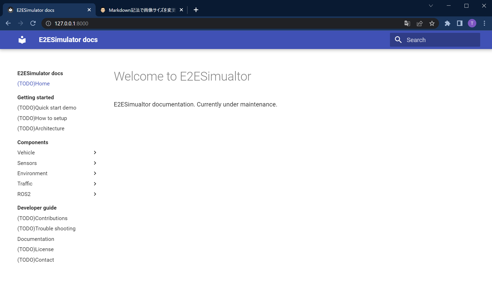

# Documentation
This document uses [Material for MkDocs](https://squidfunk.github.io/mkdocs-material/). 

## Local hosting

1 Install Material for `MkDocs`.
```
$ pip install mkdocs-material
```
2 Hosting on localhost.
```
$ cd Purdue-AI-Racing-Simulator
$ mkdocs serve
INFO     -  Building documentation...
INFO     -  Cleaning site directory
INFO     -  Documentation built in 0.16 seconds
INFO     -  [03:13:22] Watching paths for changes: 'docs', 'mkdocs.yml'
INFO     -  [03:13:22] Serving on http://127.0.0.1:8000/
```


3 Access `http://127.0.0.1:8000/` with a web browser.
<!-- (TODO change image) -->


For further reference see [Material for MkDocs - Getting started](https://squidfunk.github.io/mkdocs-material/getting-started/).

## MkDocs files
Use the following `/docs` directory and `mkdocs.yml` for new documentation files.
```
Purdue-AI-Racing-Simulator
├─ docs/                // markdown and image file for each document.
└─ mkdocs.yml           // mkdocs config.
```
Create one directory per document. For example, the directory structure of this "Documentation" page might look like this.
```
Purdue-AI-Racing-Simulator
└─ docs/                            // Root of all documents
    └─ DeveloperGuide               // Category
        └─ Documentation            // Root of each document
            ├─ index.md             // Markdown file
            └─ image_0.png          // Images used in markdown file
```

## Deploy & Hosting
When docs are pushed to the main branch, they are deployed to GitHub Pages using GitHub Actions. See also [Material for MkDocs - Publishing your site](https://squidfunk.github.io/mkdocs-material/publishing-your-site/)

# External Libraries

List of external libraries used in PAIRSIM.

|Library|Usage|URL|
|:--|:--|:--|
|ros2-for-unity|ROS2 communication|[https://github.com/RobotecAI/ros2-for-unity](https://github.com/RobotecAI/ros2-for-unity)|
