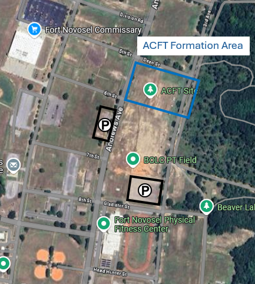

# ACFT CONOP

## Mission

Conduct the Army Combat Fitness Test (ACFT). The ACFT is the assessment for the physical domain of the Army's Holistic Health and Fitness System. 

## Map Layout

See embedded google map links: 

- [ACFT Formation Area](https://maps.app.goo.gl/PB3U9sXooTPtaygX8)
- [West Parking Area](https://maps.app.goo.gl/tWqr6Q6jSKogmXV36)
- [South Parking Area](https://maps.app.goo.gl/AvRmwvuhShAFKyNG9)

## 2-Mile Route

!!! info
    - The finish line is further down than the start line
    - On the route North along 3rd Avenue, past Crusader St, you will need to take one loop around the track

## Timeline

### Date: 

01 APR 2025

### Times:

- 0515 – Formed up NLT; Preparatory drills begin
- 0600 – ACFT is conducted
- 0715 – Event concluded

## Uniform

- Summer APFU
- Jacket (pending weather conditions)
- Appropriate color PT Belt 
- Water Source

## Command and Control

OIC: CPT Jeremy LaGroue

Phone: +1 (817) 880-2653

AOIC: 1LT Alvin Ye

Phone: +1 (917) 863-7713

## Tasks to Subordinates

- Be there at the right place, right time, with the right uniform
- Per ATP 7-22.1, all servicemembers are required to know the standards/scores for all ACFT events before showing up for the ACFT
- Familiarize yourself with the ACFT 2-mile route prior to showing up

## Coordinating Instructions

- Be careful of vehicles along roads and exiting parking lot
