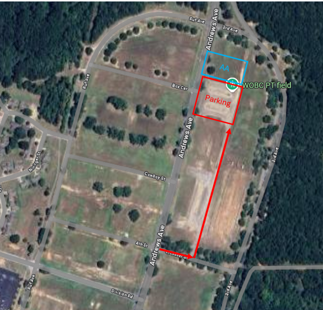

# Operation 83 CONOP

Download CONOP as a .pptx [here](https://1drv.ms/f/c/83144c9a1f1c11f1/Ent2Y58DEJ1Fgq3sVxdfdV8Bos4JPDmg2v7zTT1cL5xxtQ?e=x2j6E1)

## Mission

BOLC 25-012 and BOLC Bypass personnel  will conduct a flight aboard a UH-60 to enhance understanding of the airframe and build unit cohesion in a safe and controlled environment.

## Map Layout

See embedded google map links: 

- [Entry to AA via Crusader St](https://maps.app.goo.gl/f8gPDLC7RKhWxNJ6A)
- [Parking area south of AA](https://maps.app.goo.gl/XyVTCraMQpDHvXpB6)
- [AA Beside WOBC PT field](https://maps.app.goo.gl/f8yNSJffRdsUVoZq7)

## Timeline

### Date: 

28 MAR 2025

### Times:

- 0745 – Formed up NLT
- 1200 – Event concluded

## Uniform

- ACUs
- Eyepro
- Earpro
- Water Source

!!! warning

    NO PT BELT

## Command and Control

OIC: CPT Jeremy LaGroue

Phone: +1 (817) 880-2653

AOIC: 1LT Alvin Ye

Phone: +1 (917) 863-7713

## Tasks to Subordinates

- Be there at the right place, right time, with the right uniform

## Coordinating Instructions

- All personnel, including BOLC bypass will be attending
- [Entry to AA via Crusader St](https://maps.app.goo.gl/f8gPDLC7RKhWxNJ6A)
- [Parking area south of AA](https://maps.app.goo.gl/XyVTCraMQpDHvXpB6)
- [AA Beside WOBC PT field](https://maps.app.goo.gl/f8yNSJffRdsUVoZq7)

