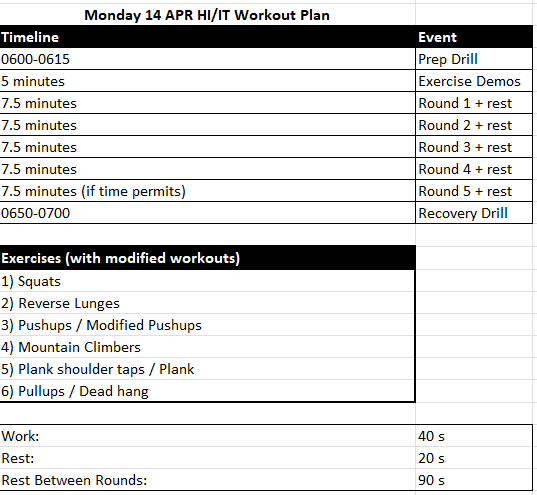
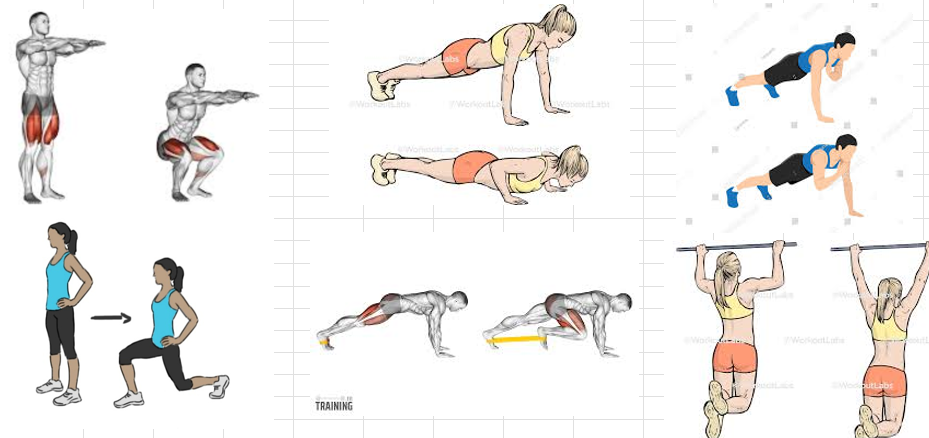
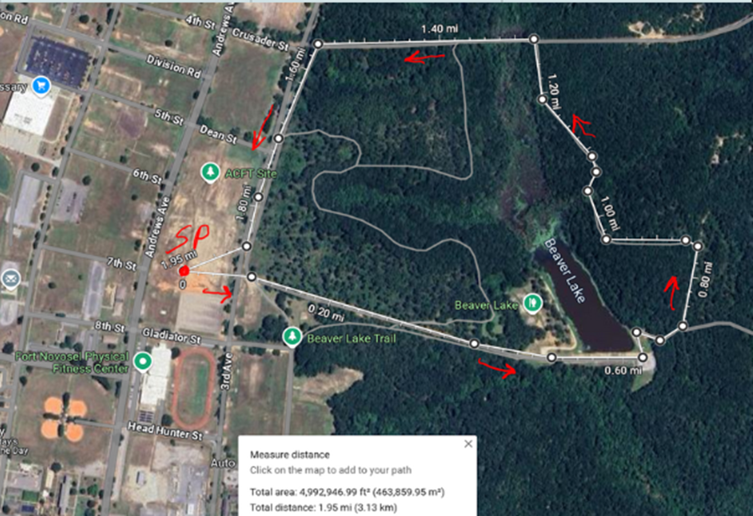
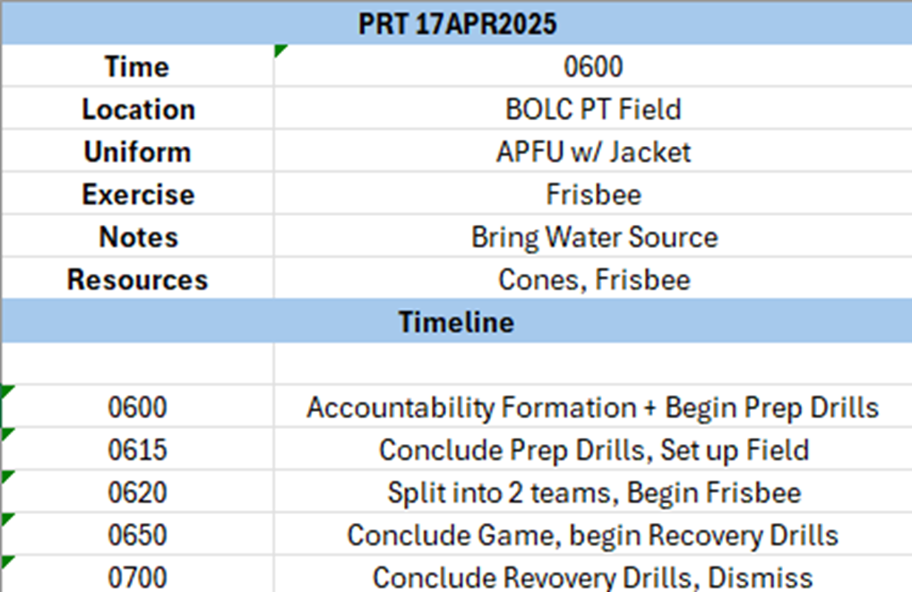

# PRT Schedule [14 APR - 17 APR]

|            | Monday 14 APR              | Tuesday 15 APR                 | Wednesday 16 APR            | Thursday 17 APR              | Friday 18 APR              |
|------------|----------------------|--------------------------|-----------------------|------------------------|----------------------|
| **PRT Leader**    | 1LT Alvin Ye      | 2LT Friedrichsen         | 2LT Zhang    |    2LT Fynaardt      | DONSA  |
| **PHASE 1**    | Preparation Drill      | Preparation Drill         | Preparation Drill    | Preparation Drill         | DONSA  |
| **PHASE 2**   | HIIT Workout    | Release Run | Gym Day     | Frisbee Thursdays | DONSA |
| **PHASE 3** | Recovery Drill   | Self-Stretching | Self-Stretching         | Recovery Drill | DONSA |

!!! info

    - The PRT leader is expected to lead all phases of training. Training plan for this week must be sent to 1LT Ye NLT Thursday 10 APR 2025

    - The PRT leader is expected to take accountability after the training is complete

    - Any equipment around our PT Area, or within the ACFT connexes can be used 

    - Speakers are allowed for outside exercises, songs must not contain any profanity

    - During gym days, all exercises must be done in pairs (such as with a spotter)

    - The recovery drill is optional for Release Runs and Gym Days

    - Phase 2 of training must not stop sooner than 0650

    - Frisbee Thursdays are sacred, any attempts to subvert them will be punishable by execution

## Monday: HI/IT Workout 

## Tuesday: Release Run

## Wednesday: Gym Day

## Thursday: Frisbee Day

