# PRT Schedule [21 APR - 24 APR]

|            | Monday               | Tuesday                  | Wednesday             | Thursday               | Friday               |
|------------|----------------------|--------------------------|-----------------------|------------------------|----------------------|
| **PRT Leader**    | TBD      | SWIM TEST         | TBD    |    TBD      | RUCK RUN  |
| **PHASE 1**    | Preparation Drill      | SWIM TEST         | Preparation Drill    | Preparation Drill         | RUCK RUN  |
| **PHASE 2**   | HIIT Workout    | SWIM TEST |  Gym Day    | Frisbee Thursdays | RUCK RUN |
| **PHASE 3** | Recovery Drill   | SWIM TEST | Recovery Drill          | Recovery Drill | RUCK RUN |

!!! info

    - The PRT leader is expected to lead all phases of training. Training plan for this week must be sent to 1LT Ye NLT Thursday 17 APR 2025 

    - Any equipment around our PT Area, or within the ACFT connexes can be used. 

    - For gym days, please make a training plan that can utilize the facilities in the Fortenberry-Colton Physical Fitness Center, NOT the Fort Novosel Physical Fitness Center.

    - Phase 2 of training must not stop sooner than 0650

# Preparation Drill Overview

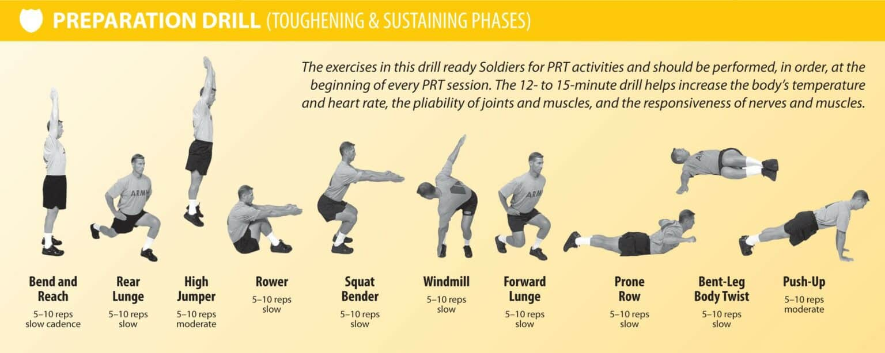

# Recovery Drill Overview

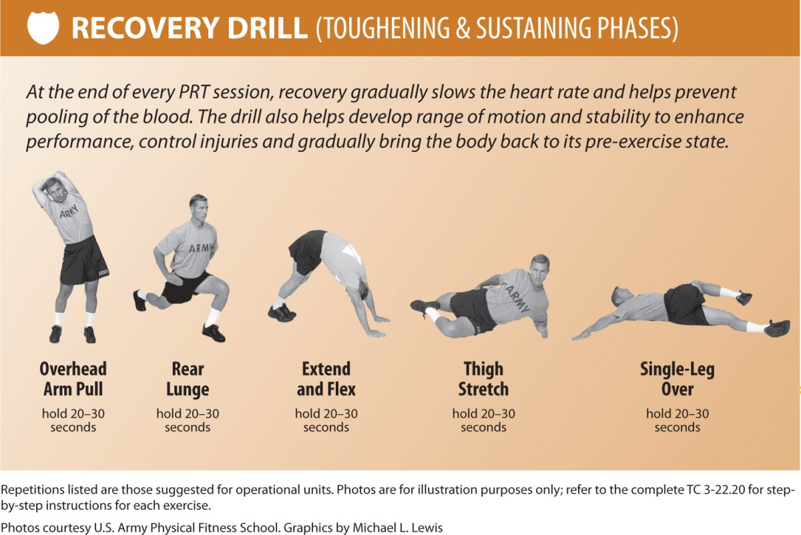

# Preparation Drill Steps

1- Bend and Reach

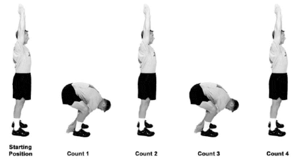

2- Rear Lunge

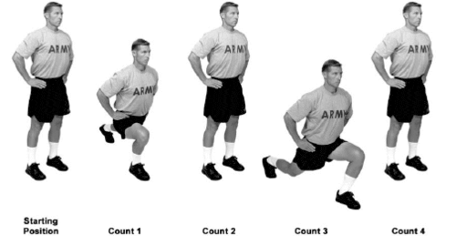

3- High Jumper

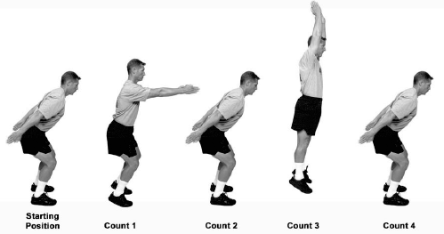

4- Rower

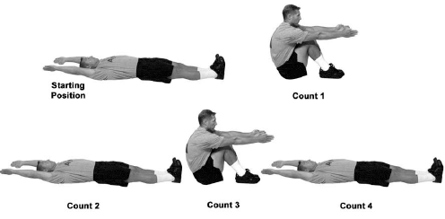

5- Squat Bender

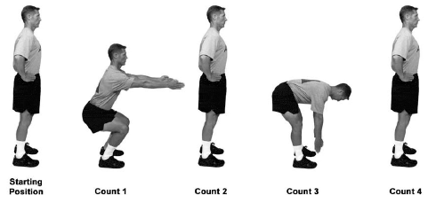

6- Windmill

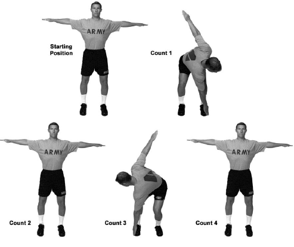

7- Forward Lunge

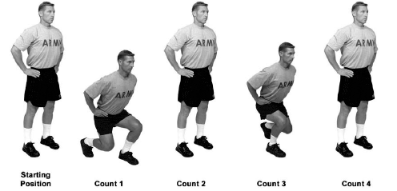

8- Prone Row

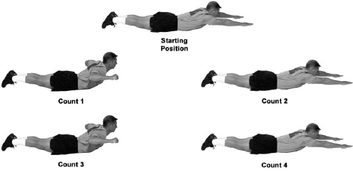

9- Bent-Leg Body Twist

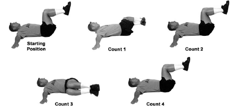

10- Pushup

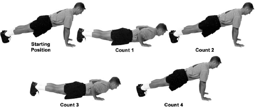

