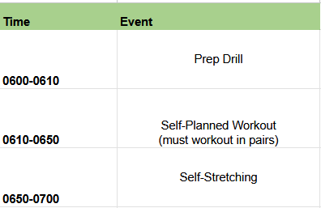

# PRT Schedule [21 APR - 24 APR]

|            | Monday 21 APR              | Tuesday 22 APR                | Wednesday 23 APR            | Thursday 24 APR              | Friday               |
|------------|----------------------|--------------------------|-----------------------|------------------------|----------------------|
| **PRT Leader**    | 2LT Brewer      | SWIM TEST         | 2LT Mouritsen    |    2LT Jones      | RUCK RUN  |
| **PHASE 1**    | Preparation Drill      | SWIM TEST         | Preparation Drill    | Self-Stretching         | RUCK RUN  |
| **PHASE 2**   | Release Run    | SWIM TEST |  Gym Day    | Frisbee Thursdays | RUCK RUN |
| **PHASE 3** | Self-Stretching    | SWIM TEST | Self-Stretching          | Self-Stretching | RUCK RUN |

!!! info

    - Show up early for accountability at 0550 (0540 for Frisbee Thursdays), Uniform is summer APFU w/ Jacket (no pants)

    - The PRT leader is expected to lead all phases of training. Training plan for this week must be sent to 1LT Ye NLT Thursday 17 APR 2025 

    - The PRT leader is expected to take accountability after the training is complete

    - Any equipment around our PT Area, or within the ACFT connexes can be used 

    - Speakers are allowed for outside exercises, songs must not contain any profanity

    - During gym days, all exercises must be done in pairs (such as with a spotter)

    - The recovery drill is optional for Release Runs and Gym Days

    - Phase 2 of training must not stop sooner than 0650

    - If you want to do something different for your PT day please let me know (like swapping HI/IT for a release run instead)

## Monday: Release Run

## Tuesday: Swim Test

Location: Pool

Time: 0600

Uniform: Summer APFU (bring ACU top + bottoms, and boots to wear over it)

Test criteria: Swim 100 meters and float/tread for 2 minutes

## Wednesday: Gym Day

## Thursday: Frisbee Day

Show up NLT 0540 to set up cones. See map below:

## Friday: Ruck

More details to follow...

