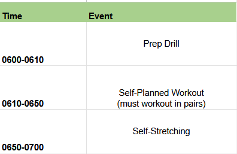

# PRT Schedule [28 APR - 2 May]

|            | Monday 28 APR              | Tuesday 29 APR                 | Wednesday 30 APR            | Thursday 01 MAY              | Friday 02 MAY              |
|------------|----------------------|--------------------------|-----------------------|------------------------|----------------------|
| **PRT Leader**    | 2LT Aukland      | 2LT Walters         | NO PRT    |    2LT Brown      | 2LT Tracey  |
| **PHASE 1**    | Preparation Drill      | Preparation Drill         | NO PRT   | Self-Stretching         | Preparation Drill  |
| **PHASE 2**   | Release Run    | HIIT Workout | NO PRT    | Frisbee Thursdays | Gym Day |
| **PHASE 3** | Guided or Self-Stretching   | Recovery Drill | NO PRT         | Self-Stretching | Self-Stretching |

!!! info

    - Show up early for accountability at 0550 (0540 for Frisbee Thursdays) , Uniform is summer APFU w/ Jacket (no pants)
    
    - The PRT leader is expected to lead all phases of training. Training plan for this week must be sent to 1LT Ye NLT Thursday 24 APR 2025.

    - The PRT leader is expected to take accountability after the training is complete

    - Any equipment around our PT Area, or within the ACFT connexes can be used 

    - Speakers are allowed for outside exercises, songs must not contain any profanity

    - During gym days, all exercises must be done in pairs (such as with a spotter)

    - The recovery drill is optional for Release Runs and Gym Days

    - Phase 2 of training must not stop sooner than 0650

    - If you want to do something different for your PT day please let me know (like swapping HI/IT for a release run instead)

## Monday: Release Run 

## Tuesday: HI/IT Workout

After accountability, move over to the track behind the gym for all phases of PT:

see map location [here](https://maps.app.goo.gl/RYMZqSQnWb91ndGF7)

## Thursday: Frisbee Day

Show up NLT 0545 to set up cones. See map below:

## Friday: Gym Day

