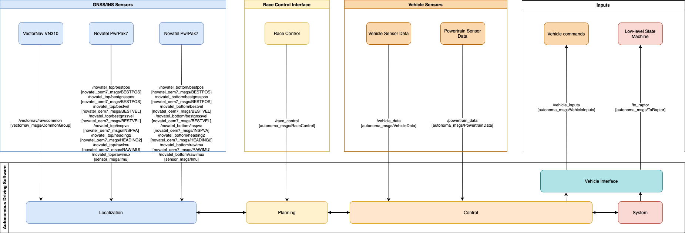

The tables of topics the racing sim publishes and subscribes from can be found below.
The list can be extended by the user for the specific use case.
To see how to custom messages type for ROS2, please refer to [Add custom ROS2 message type](../../Components/ROS2/AddCustomROS2MessageType/index.md) document.

**The Autonoma custom messages used for the racing simulator can be found [HERE](https://github.com/autonomalabs/sim-msgs).**

Users can choose to control the racecar via the high-level ROS2 interface (`/vehicle_data`, `/powertrain_data`, `/race_control`, `/vehicle_inputs`, `/to_raptor`) OR the low-level CAN interface (`/from_can_bus`, `/to_can_bus`). The DBC file with the message definitions for the 2024 low-level CAN interface [can be found here](CAN1-INDY-V17.dbc).

## Publisher list

|category|topic|msg|frame_id|hz|QoS|
|:--|:--|:--|:--|:--|:--|
|GNSS/INS|`/novatel_<top/bottom>/imu/data`|`sensor_msgs/msg/Imu`|gps_<top/bottom>|`100`|`Reliable`, `Volatile`, `Keep last/10`|
|GNSS/INS|`/novatel_<top/bottom>/imu/data_raw`|`sensor_msgs/msg/Imu`|gps_<top/bottom>_imu|`100`|`Reliable`, `Volatile`, `Keep last/10`|
|GNSS/INS|`/novatel_<top/bottom>/ins_twist`|`geometry_msgs/msg/TwistWithCovarianceStamped`|gps_<top/bottom>|`100`|`Reliable`, `Volatile`, `Keep last/10`|
|Odometry|`/novatel_<top/bottom>/odom`|`nav_msgs/msg/Odometry`|utm|`100`|`Reliable`, `Volatile`, `Keep last/10`|
|Vehicle|`/novatel_<top/bottom>/fix`|`sensor_msgs/msg/NavSatFix`|gps_<top/bottom>_ant1|`100`|`Reliable`, `Volatile`, `Keep last/10`|
|Vehicle|`/vehicle_data`|`autonoma_msgs/VehicleData`|none|`100`|`Reliable`, `Volatile`, `Keep last/10`|
|Vehicle|`/powertrain_data`|`autonoma_msgs/PowertrainData`|none|`100`|`Reliable`, `Volatile`, `Keep last/10`|
|Race Control|`/race_control`|`autonoma_msgs/RaceControl`|none|`10`|`Reliable`, `Volatile`, `Keep last/10`|
|Raw CAN bus data|`/from_can_bus`|`can_msgs/Frame`|none|`500`|`Reliable`, `Volatile`, `Keep last/10` |
|GNSS/INS|`/novatel_<top/bottom>/rawimu`|`novatel_oem7_msgs/RAWIMU`|none|`100`|`Reliable`, `Volatile`, `Keep last/10`|
|GNSS/INS|`/novatel_<top/bottom>/bestpos`|`novatel_oem7_msgs/BESTPOS`|none|`100`|`Reliable`, `Volatile`, `Keep last/10`|
|GNSS/INS|`/novatel_<top/bottom>/bestgnsspos`|`novatel_oem7_msgs/BESTPOS`|none|`100`|`Reliable`, `Volatile`, `Keep last/10`|
|GNSS/INS|`/novatel_<top/bottom>/bestvel`|`novatel_oem7_msgs/BESTVEL`|none|`100`|`Reliable`, `Volatile`, `Keep last/10`|
|GNSS/INS|`/novatel_<top/bottom>/bestgnssvel`|`novatel_oem7_msgs/BESTVEL`|none|`100`|`Reliable`, `Volatile`, `Keep last/10`|
|GNSS/INS|`/novatel_<top/bottom>/inspva`|`novatel_oem7_msgs/INSPVA`|none|`100`|`Reliable`, `Volatile`, `Keep last/10`|
|GNSS/INS|`/novatel_<top/bottom>/heading2`|`novatel_oem7_msgs/HEADING2`|none|`100`|`Reliable`, `Volatile`, `Keep last/10`|
|GNSS/INS|`/vectornav/raw/common`|`vectornav_msgs/CommonGroup`|none|`100`|`Reliable`, `Volatile`, `Keep last/10`|

## Subscriber list

|category|topic|msg|frame_id|hz|QoS|
|:--|:--|:--|:--|:--|:--|
|Vehicle|`/vehicle_inputs`|`autonoma_msgs/VehicleInputs`|none|`100`|`Reliable`, `Volatile`, `Keep last/10`|
|Vehicle|`/to_raptor`|`autonoma_msgs/ToRaptor`|none|N/A|`Reliable`, `Volatile`, `Keep last/10`|
|Raw CAN bus data|`/to_can_bus`|`can_msgs/Frame`|none|`10`|`Reliable`, `Volatile`, `Keep last/10` |

## Block Diagram

